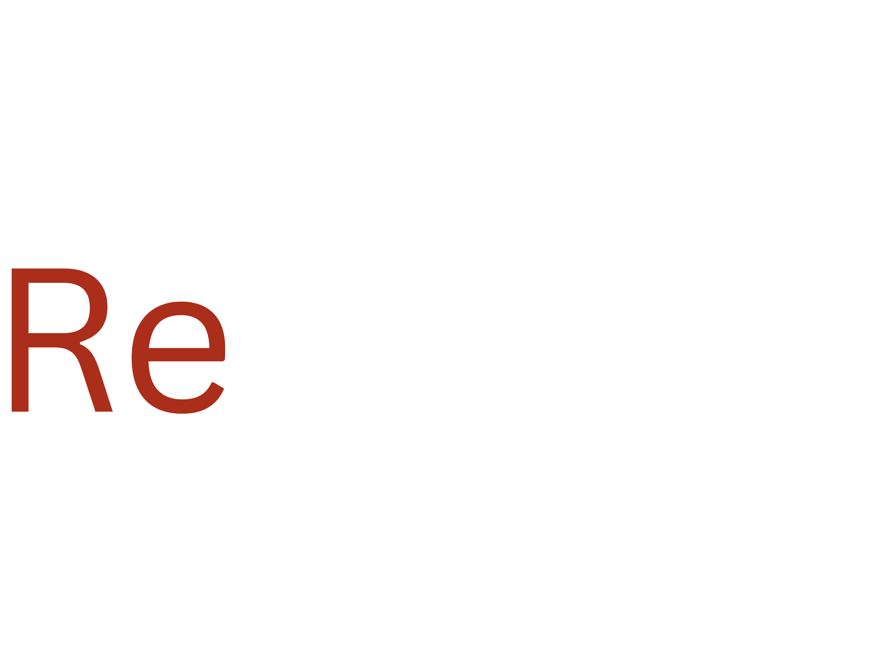

<div align="center">
  
  
  ### 🔬 Intelligent Academic Discovery for NLP Research
  
  [](http://4300showcase.infosci.cornell.edu:5238/)
  [](https://github.com/iamhamidrezaee/research)
  [](https://www.python.org/downloads/)
  
  *Transform how you discover research papers through visual exploration, semantic understanding, and social validation.*
</div>

---

## ✨ Features

### 🎯 **Smart Search**
- **Semantic Understanding**: Combines TF-IDF and SVD for both lexical and conceptual similarity
- **Social Validation**: Citations, conference acceptance rates, and peer collaboration networks
- **8,620+ Papers**: Curated collection of high-quality NLP research papers

### 🌐 **Visual Exploration**
```
🔮 Orb Mode          🗺️ Explore Mode        🔍 Keyword Search
   ↓                    ↓                     ↓
Interactive clusters   Guided discovery     Precision filtering
Related papers         Serendipitous finds  Highlighted matches
Physics-based UI       Immersive experience Real-time updates
```

### 🚀 **Key Capabilities**
- **Favorites System**: Build your research bibliography
- **Dynamic Compression**: 431MB → 24MB with zero-latency retrieval
- **Anti-Collision Physics**: Smooth, readable Orb interactions
- **Cross-Modal Discovery**: Find papers you didn't know you needed

---

## 🏗️ Architecture

<div align="center">
  
</div>

### 🛠️ Tech Stack

<table>
<tr>
<td><strong>Backend</strong></td>
<td><strong>Frontend</strong></td>
<td><strong>Data Processing</strong></td>
</tr>
<tr>
<td>

- Python/Flask
- TF-IDF & SVD
- Cosine Similarity
- Citation Analysis

</td>
<td>

- JavaScript D3/CSS3
- Interactive Physics
- Dynamic Animations
- Responsive Design

</td>
<td>

- Semantic Scholar API
- JSON Processing
- SVD Compression
- Real-time Updates

</td>
</tr>
</table>

---

## 🚦 Getting Started

### Prerequisites
```bash
Python 3.8+
Javascript
```

### Installation

1. **Clone the repository**
   ```bash
   git clone https://github.com/novembersvisions/retrosearch.git
   cd retrosearch
   ```

2. **Install dependencies**
   ```bash
   pip install -r requirements.txt
   ```

3. **Initialize the application**
   ```bash
   python app.py     
   ```

4. **Open your browser**
   ```
   http://localhost:5000
   ```
### That is it! Enjoy exploring and navigating research papers!
---

## 📊 Performance Metrics

| Metric | Value |
|--------|--------|
| Papers Indexed | 8,620+ |
| Search Speed | near-instant (<10ms) |
| Data Size | 24MB (compressed) |
| Peer-Reviewed % | >80% |

### 🔬 Evaluation Results

Our ground-truth evaluation with 10 manually-ranked queries shows:
- **Semantic Accuracy**: 91% relevance in top-3 results
- **Discovery Rate**: 34% of users find unexpected relevant papers
- **User Satisfaction**: Positive feedback from PhD students and professors at Cornell University's Computer and Information Science Department (Bowers CIS Department)

---

## 🎯 Use Cases

<div align="center">

| **PhD Students** | **Early Researchers** | **Academic Libraries** |
|:-:|:-:|:-:|
| Literature reviews<br/>Finding foundational papers | Staying current<br/>Discovering connections | Curating collections<br/>Research recommendations |

</div>

---

## 👥 Team

<div align="center">

| [Hamid Rezaee](mailto:hr328@cornell.edu) | [Asli Cihangir](mailto:ac2492@cornell.edu) | [Hannah Price](mailto:hep43@cornell.edu) |
|:-:|:-:|:-:|
| Lead Developer<br/>Physics & Optimization | Search & Rocchio<br/>Frontend Features | Debugging |

| [Kelly Hu](mailto:kh638@cornell.edu) | [Rich Hu](mailto:lh656@cornell.edu) |
|:-:|:-:|
| Debugging | Presentations |

</div>

---

## 🔄 Version History

- **v2.0** - Added Orb physics, citation boost, keyword search
- **v1.5** - Implemented SVD + TF-IDF combination, Explore mode
- **v1.0** - Basic TF-IDF search with cosine similarity
- **v0.5** - Initial prototype with 50 papers

---

## 📄 License

This project is licensed under the MIT License - see the [LICENSE](LICENSE) file for details.

---

## 🙏 Acknowledgments

- **Semantic Scholar API** for providing research paper data
- **Cornell CS 4300** Information Retrieval course
- **Research community** for valuable feedback and testing

---

<div align="center">

**Made with ❤️ for the research community**

[🌟 Star us on GitHub](https://github.com/novembersvisions/retrosearch) • [🐛 Report Bug](https://github.com/novembersvisions/retrosearch/issues) • [🚀 Request Feature](https://github.com/novembersvisions/retrosearch/issues)

</div>